# Boycott Products Website

A web application to identify products linked to Israel and provide ethical alternatives.

## Screenshots

### Home Page

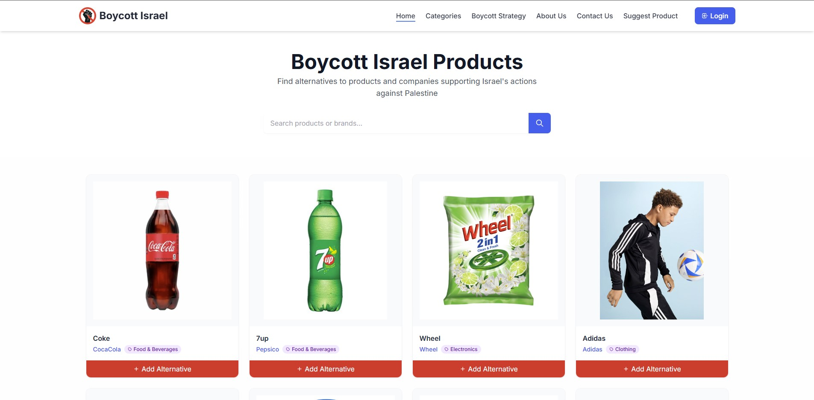

### About Page

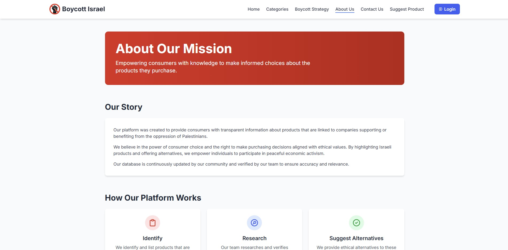

### Category Page

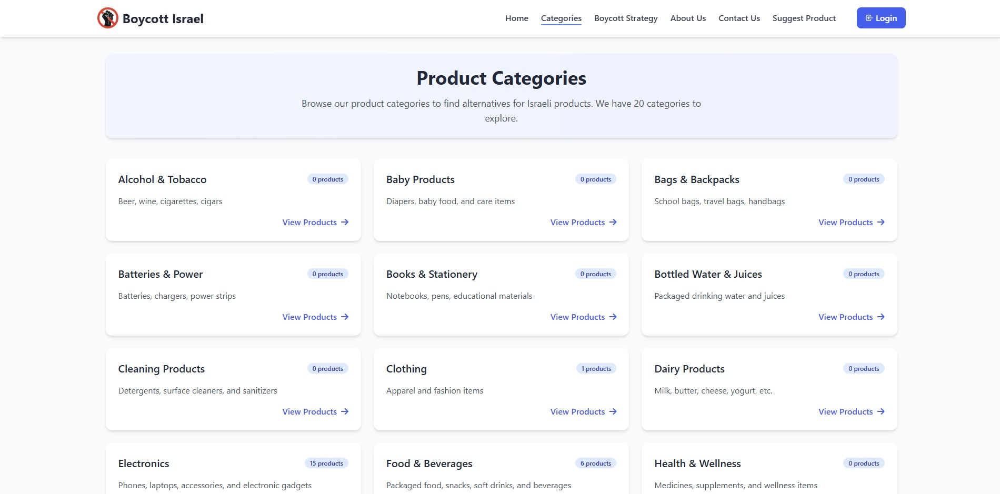

### Contact Page

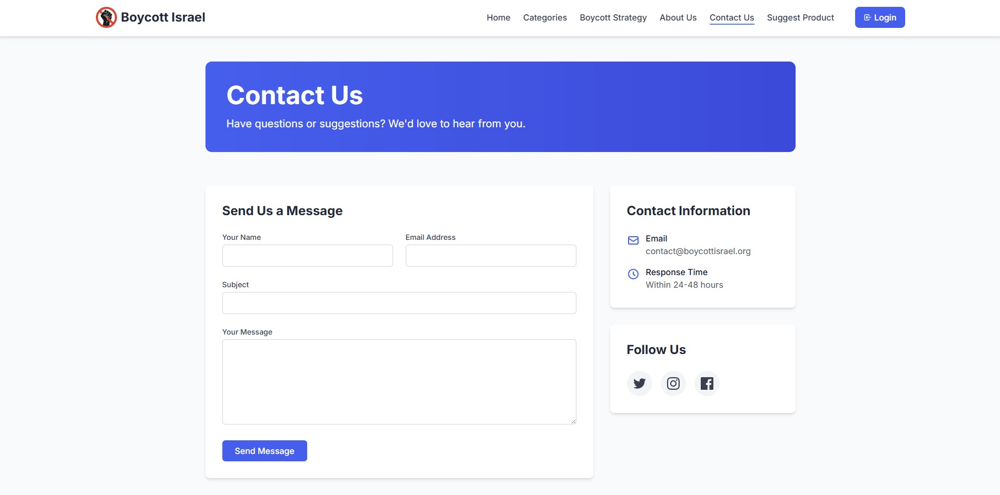

### How to Boycott Page

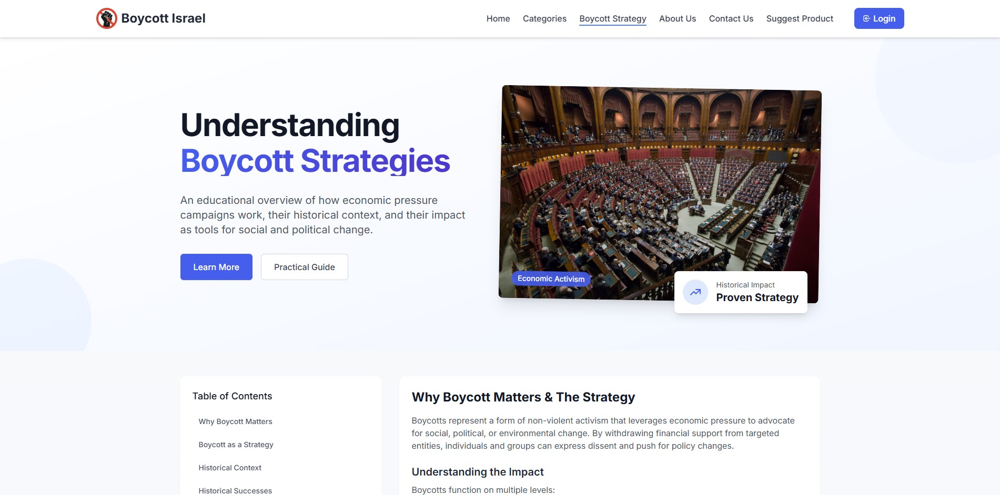

### Product Suggestion Page

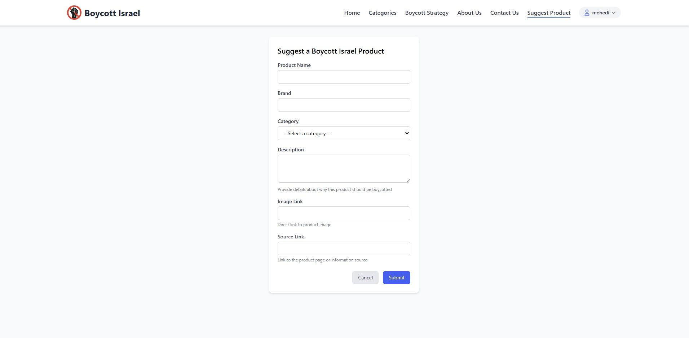

### Suggested Products Page

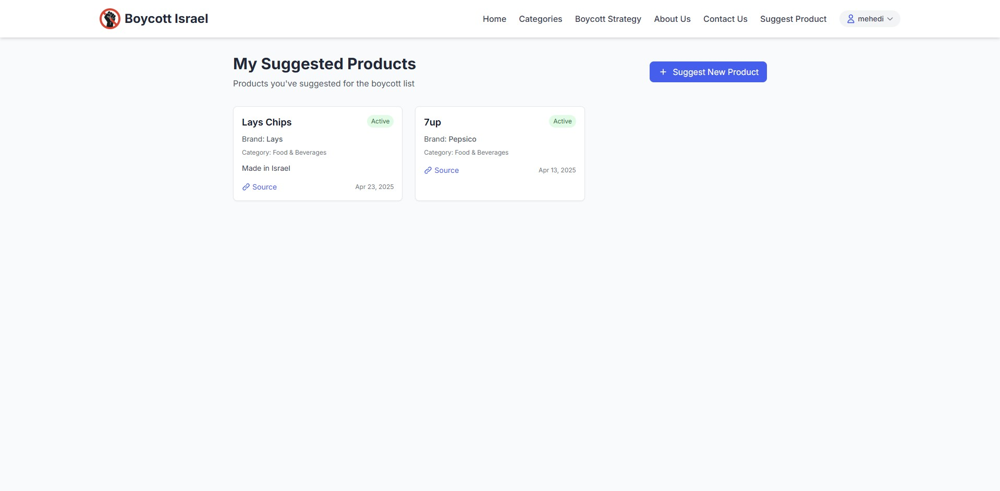

### User Authentication

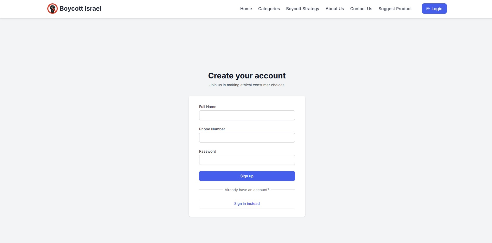
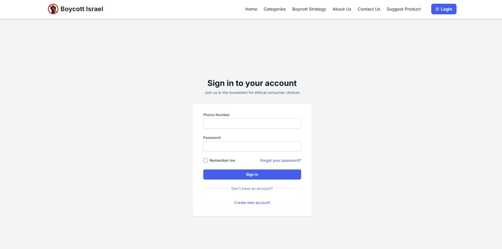

### Admin Dashboard

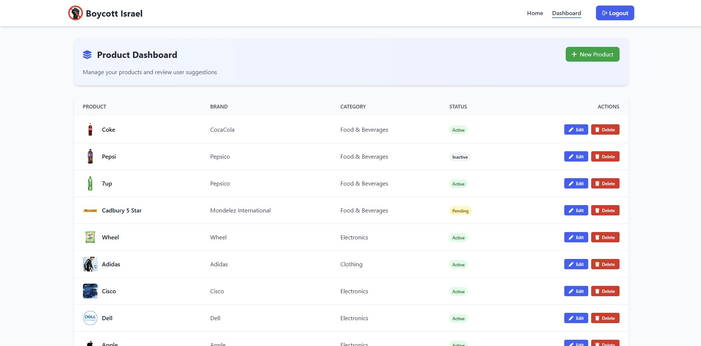
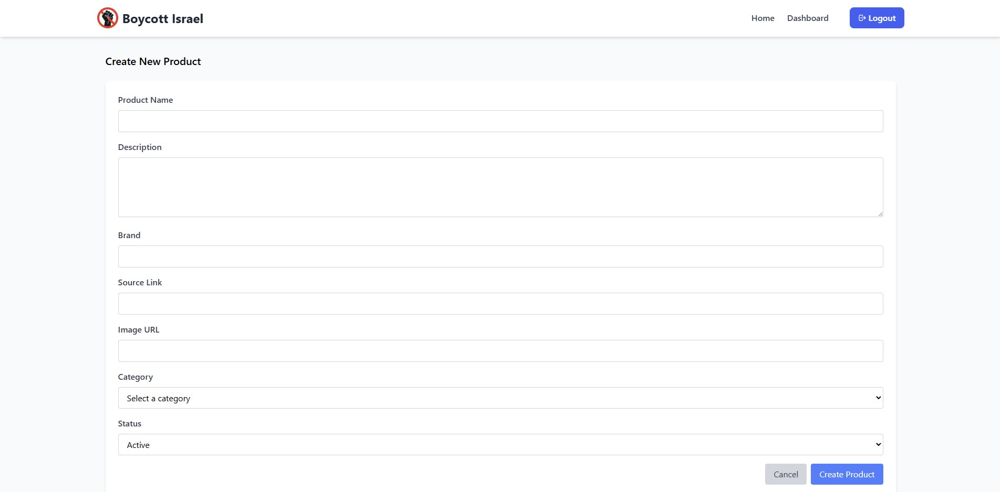

## Database Setup Guide

Follow these steps to set up the database for this project:

1. Create a new database named `boycott_israel` in your MySQL server
2. Run the following SQL commands to create the required tables and insert initial data

```sql
-- Create the database
CREATE DATABASE boycott_israel;
USE boycott_israel;

-- Create categories table
CREATE TABLE categories (
  id int(11) NOT NULL AUTO_INCREMENT,
  name varchar(100) NOT NULL,
  description text DEFAULT NULL,
  created_at timestamp NOT NULL DEFAULT current_timestamp(),
  PRIMARY KEY (id),
  UNIQUE KEY name (name)
) ENGINE=InnoDB DEFAULT CHARSET=utf8mb4 COLLATE=utf8mb4_general_ci;

-- Create users table
CREATE TABLE users (
  id int(11) NOT NULL AUTO_INCREMENT,
  name varchar(100) NOT NULL,
  phone varchar(15) NOT NULL,
  password varchar(255) NOT NULL,
  created_at timestamp NOT NULL DEFAULT current_timestamp(),
  role varchar(50) NOT NULL DEFAULT 'user',
  PRIMARY KEY (id),
  UNIQUE KEY phone (phone)
) ENGINE=InnoDB DEFAULT CHARSET=utf8mb4 COLLATE=utf8mb4_general_ci;

-- Create products table
CREATE TABLE products (
  id int(11) NOT NULL AUTO_INCREMENT,
  name varchar(255) NOT NULL,
  brand varchar(100) NOT NULL,
  image varchar(255) NOT NULL,
  link varchar(255) NOT NULL,
  is_israeli tinyint(1) DEFAULT 1,
  description text DEFAULT NULL,
  status varchar(50) DEFAULT NULL,
  category_id int(11) DEFAULT NULL,
  created_by int(11) DEFAULT NULL,
  created_at timestamp NOT NULL DEFAULT current_timestamp(),
  PRIMARY KEY (id),
  KEY fk_category (category_id),
  CONSTRAINT fk_category FOREIGN KEY (category_id) REFERENCES categories (id) ON DELETE SET NULL
) ENGINE=InnoDB DEFAULT CHARSET=utf8mb4 COLLATE=utf8mb4_general_ci;

-- Create alternative_products table
CREATE TABLE alternative_products (
  id int(11) NOT NULL AUTO_INCREMENT,
  name varchar(255) NOT NULL,
  brand varchar(100) NOT NULL,
  image varchar(255) NOT NULL,
  link varchar(255) NOT NULL,
  status varchar(50) DEFAULT 'active',
  ref_id int(11) NOT NULL,
  created_at timestamp NOT NULL DEFAULT current_timestamp(),
  description text DEFAULT NULL,
  PRIMARY KEY (id),
  KEY ref_id (ref_id),
  CONSTRAINT alternative_products_ibfk_1 FOREIGN KEY (ref_id) REFERENCES products (id) ON DELETE CASCADE
) ENGINE=InnoDB DEFAULT CHARSET=utf8mb4 COLLATE=utf8mb4_general_ci;
```

## Initial Data Setup

Run these commands to populate the database with initial data:

```sql
-- Insert admin user (password: admin123)
INSERT INTO users (name, phone, password, role)
VALUES ('admin', '01860222102', '$2y$10$ma0S/85HVTCd/FMQAtzOye8nHwVtFRRGFDEfKpKw.StLzxjTWAHDO', 'admin');

-- Insert basic categories
INSERT INTO categories (name, description) VALUES
('Food & Beverages', 'Packaged food, snacks, soft drinks, and beverages'),
('Electronics', 'Phones, laptops, accessories, and electronic gadgets'),
('Personal Care', 'Skincare, soaps, shampoos, and cosmetics'),
('Cleaning Products', 'Detergents, surface cleaners, and sanitizers'),
('Health & Wellness', 'Medicines, supplements, and wellness items'),
('Baby Products', 'Diapers, baby food, and care items'),
('Clothing', 'Apparel and fashion items'),
('Shoes', 'Footwear including casual, formal, and sports shoes'),
('Jewelry & Accessories', 'Watches, sunglasses, jewelry'),
('Supermarket Essentials', 'Groceries and daily household items'),
('Kitchen & Home Appliances', 'Mixers, grinders, electric kettles, etc.'),
('Snacks & Confectionery', 'Chips, chocolates, candies, biscuits');

-- Insert sample products
INSERT INTO products (name, brand, image, link, is_israeli, description, status, category_id, created_by) VALUES
('Coca-Cola', 'CocaCola', 'https://gofresh.com.bd/wp-content/uploads/2020/04/coca-cola-bottle-1.jpg', 'https://www.coca-colacompany.com', 1, 'The Central Beverage Company, known as Coca-Cola Israel, is a private Israeli manufacturer and distributor of soft drinks, dairy products and alcoholic beverages. The company is the exclusive franchisee of The Coca-Cola Company in Israel.', 'active', 1, 1),
('Apple iPhone', 'Apple', 'https://yt3.googleusercontent.com/s5hlNKKDDQWjFGzYNnh8UeOW2j2w6id-cZGx7GdAA3d5Fu7zEi7ZMXEyslysuQUKigXNxtAB=s900-c-k-c0x00ffffff-no-rj', 'https://www.apple.com', 1, 'Acquired several Israeli companies and conducts limited R&D activities in Israel focusing on semiconductor technologies.', 'active', 2, 1);

-- Insert sample alternative products
INSERT INTO alternative_products (name, brand, image, link, status, ref_id, description) VALUES
('Mojo', 'AKIJ', 'https://i.chaldn.com/_mpimage/mojo-soft-drink-2-ltr?src=https%3A%2F%2Feggyolk.chaldal.com%2Fapi%2FPicture%2FRaw%3FpictureId%3D130804&q=best&v=1', 'https://www.akijfood.com/', 'active', 1, 'Mojo is a cola flavored carbonated soft drink manufactured by the Akij Food and Beverage Limited (AFBL). The soft drink brand Mojo has been recognized by Bangladesh Brand Forum as the "number one beverage brand in Bangladesh" in the "Best Brand Award 2024".');
```

## Login Credentials

**Admin Access:**

- Phone: 01860222102
- Password: 123456
